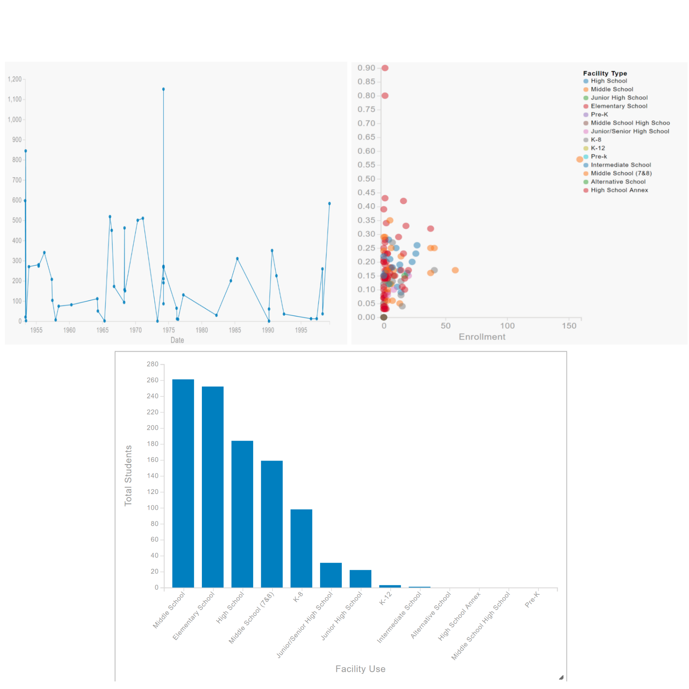

<!-- .slide: class="title" -->

## Charts & Custom Visualizations Beyond the Map

David Martinez

René Rubalcava

@DavidJmart

@odoenet

---

<!-- .slide: class="section" -->

##  Visualization

 

---

<!-- .slide: class="section" -->

### Visualizations are any medium to present data, visually, to a visual consumer.
- Cartography
- Charts
- Infographics
- Tables

---

<!-- .slide: class="section" -->

### Why Do We Visualize Data?

- Cognitive understanding is faster when visually consumed
- To understand the data
- To frame the data in a different perspective thereby making it easier to reason and consume

---

<!-- .slide: class="section" -->

## "We should never forget that a **picture of data is not the goal;** it's only the means. Information visualization is all about **gaining the understanding so we can make good decisions."**

->Stephen Fews<-

----

<!-- .slide: class="section" -->

### Understanding Data

- Compare
- Sort
- Filter
- Highlight
- Aggregate
- Re- express

---

<!-- .slide: class="section" -->

## Cedar

### JavaScript Library for Creating Charts

 

---

<!-- .slide: class="section" -->

###  Philosophy
- State of art Visualizations
- Re-usable, sharable
- Integrated with ArcGIS API
- Overridable

---

<!-- .slide: class="section" -->

### Working with Cedar

- A Cedar chart needs four things
    - Chart Type
    - Data
    - Mappings
    - DOM Element

---

<!-- .slide: class="section" -->

### Your First Cedar App

[Population](https://jsfiddle.net/dmartine/ndz81ha2/1/)

---

### Where's the Map?

<!-- .slide: class="section" -->

[Chart with Map](https://codepen.io/odoe/pen/EwvqZM)

---

<!-- .slide: class="section" -->

## Where Are We Headed?

 

---

<!-- .slide: class="section" -->

### Cedar in Open Data

- [Open Data](http://opendata.arcgis.com/ ) and Hub requirements actively driving Cedar development
- Better support and examples of SQL expressions in queries
- Ability to transform data returned from server
- Query callback for error handling
- Timeouts for slow loading Data
- Add-on for Ember apps [ember-cli-cedar](https://github.com/Esri/ember-cli-cedar)

---

<!-- .slide: class="section" -->

### Enhancements

- Better support for multi-series charts
    - Change to Cedar's JSON format (v1.0)
- More chart types
- Better default styling for charts

---

<!-- .slide: class="section" -->

### amCharts

- Basing Cedar on [amCharts](https://www.amcharts.com/javascript-charts/) would make it easier to
    - Create and customize new chart types
    - Customize or extend existing built-in chart types
    - Style and theme charts

---

<!-- .slide: class="section" -->

### Examples

1. [Bar](https://esridc.github.io/cedar-amcharts/bar.html)
2. [Time](https://esridc.github.io/cedar-amcharts/timeline.html)
3. [Pie](https://esridc.github.io/cedar-amcharts/pie.html)
4. [Timeclock](https://esridc.github.io/cedar-amcharts/radar.html)
5. [Line](https://esridc.github.io/cedar-amcharts/line.html)
6. [Scatterplot](https://esridc.github.io/cedar-amcharts/scatter.html)

---

<!-- .slide: class="questions" -->

## Questions?

**Help us to improve** filling out the survey

 

David Martinez ([@DavidJmart](https://twitter.com/DavidJmart))

Rene Rubalcava ([@odoenet](https://twitter.com/odoenet))

Slides: [github.com/odoe/presentations/2017-European-DevSummit/charts-viz/](github.com/odoe/presentations/2017-European-DevSummit/charts-viz)

---

<!-- .slide: class="end" -->
