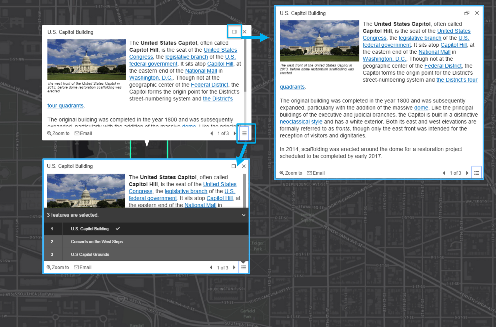
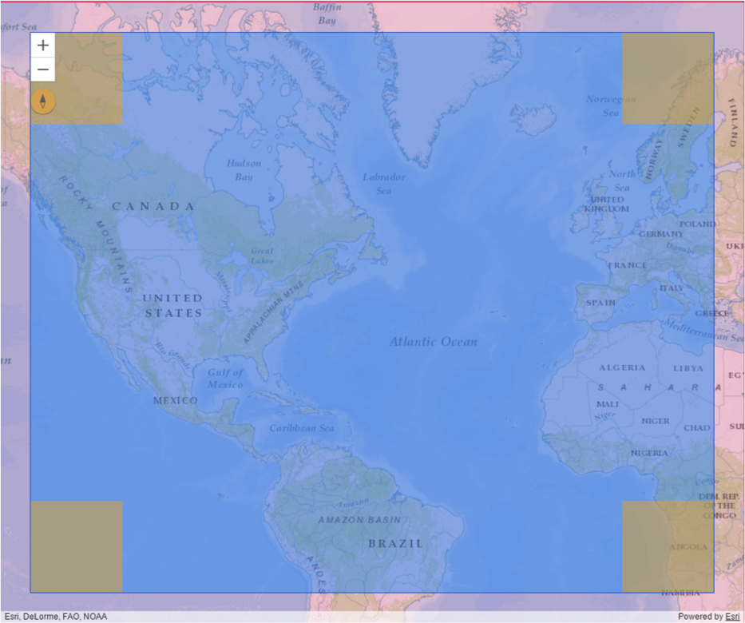
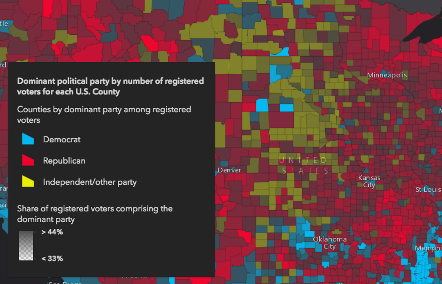

<!-- .slide: class="title" -->

## ArcGIS API for JavaScript: What’s New at 4x

Andy Gup & René Rubalcava

---

<!-- .slide: class="agenda" -->

## Agenda

- Overview
- New Fundamentals
- New Map and View Architecture
- New UI and Widgets
- New Features

---

<!-- .slide: class="section" -->

# Overview

---

## Overview

- introduction of 3D and WebScene
- New [WebScene Viewer](//www.arcgis.com/home/webscene/viewer.html) built with new API
- New [SDK](//developers.arcgis.com/javascript/) rebuilt from scratch

---

## Overview

- New Portal API
- Better integration of `WebMap` and `WebScene`
 - place the intelligence of the [arcgis.com map viewer](//www.arcgis.com/home/webmap/viewer.html) in the API
 - addition of missing components like `GroupLayer`
 - switching spatial reference
- APIs and Widgets redesign

---

## Overview

- New development patterns
- New architecture
- 3D
- AMD only
- Modern browsers only: `IE11+`

---

<!-- .slide: class="section" -->

# New Fundamentals

---

## Core modules

New core classes to get the job done
- `esri/core/Accessor`
- `esri/core/Promise`
- `esri/core/Loadable`
- `esri/core/Collection`

---

## `esri/core/Accessor`

- base class of most of the API
- consistent pattern:
 - getting and setting properties value
 - watching properties change
- unifed object constructor
- computed properties
- autocast

---

## Accessor - Properties watching

```js
var view = new MapView({ map: map });

// watch for view center updates
view.watch('center', function(value) {
  log("center set to:", value.longitude, value.latitude);
});

// watch for basemap title updates
map.watch('basemap.title', function(value) {
  log("basemap is now: ", value);
});
```

---

## Accessor - Unified Object Constructor

```js
var map = new Map({
  basemap: new Basemap({
    baseLayers: new Collection([
      new TileLayer("...")
    ])
  }),
  layers: [
    new FeatureLayer("...")
  ]
});
```

---

## Accessor - Autocast

```js
var map = new Map({
  basemap: {
    baseLayers: [
      new TileLayer(url)
    ]
  }
});

var view = new MapView({
  map: map,
  container: 'viewDiv',

  extent: {
    xmin: -180, xmax: 180,
    ymin: -80, ymax: -80,
    spatialReference: 4326
  }
});
```

---

## Accessor - Autocast

```js
  // 3.x
  new SimpleMarkerSymbol(SimpleMarkerSymbol.STYLE_SQUARE, 10,
    new SimpleLineSymbol(SimpleLineSymbol.STYLE_SOLID,
    new Color([255,0,0]), 4),
    new Color([255,255,255,0.25]));

  // 4.0
  new SimpleMarkerSymbol({
    style: 'square',
    color: 'red',
    size: 10,

    outline: {
      color: 'rgba(255, 255, 255, 0.5)'
      width: 4
    }
  });
```

---

## Accessor - Implementing

[Implementing Accessor](https://developers.arcgis.com/javascript/latest/guide/implementing-accessor/index.html)

TypeScript and Decorators

```ts
import Accessor = require("esri/core/Accessor");
import { subclass, property, declared } from "esri/core/accessorSupport/decorators";

@subclass()
class Subclass extends declared(Accessor) {
  @property()
  firstName: string;

  @property()
  lastName: string;

  @property({
    readOnly: true,
    // define the property dependencies
    dependsOn: ["firstName", "lastName"]
  })
  get fullName(): string {
    return `${this.firstName} ${this.lastName}`;
  }
}
```

---

## Promises

- All asynchronous methods return a promise, no more [events](https://developers.arcgis.com/javascript/jsapi/querytask-amd.html#events)
- The basic pattern looks like this:

```js
  someAsyncFunction().then(
    function(resolvedVal){
      //This is called when the promise resolves
      console.log(resolvedVal);  //logs the value the promise resolves to
    },
    function(error){
      //This function is called when the promise is rejected
      console.error(error);  //logs the error message
    }
  );
```

---

## Promises

- Classes may be Promise
 - Load resources
 - Asychronously initialized `Layer`, `WebMap`, `WebScene`, `View`
 - `view.then()` replaces `map.on('load', ...)`

```js
var map = new Map({...})

view = new SceneView({
  map: map,
  //...
});

view.then(function() {
  // the view is ready to go
});
```

---

## Loadables

- brings better control, and scheduling of loading resources.
- Promise-based
- the views automatically loads the map and its layers

---

## Loadables

- `WebMap` / `WebScene` need to load:
 - the portal item
 - the layer module
 - the layer's item
- `MapView` / `SceneView` need to load:
 - the map
 - the layers

---

Get a feature from a FeatureLayer from a WebMap without displaying it, ASAP!

```js
  var webmap = new WebMap({
    portalItem: {
      id: 'affa021c51944b5694132b2d61fe1057'
    }
  });

  webmap.load()
    .then(function() {
      return webmap.getLayer('myFeatureLayerId').load();
    })
    .then(function(featureLayer) {
      return featureLayer.queryFeatures({
        where: 'OBJECTID = 1'
      });
    })
    .then(function(result) {
      displayDetails(result.features[0]);
    })
    .otherwise(function(error) {
      console.error(error);
    });
```

---

## Collection

 - More or less like an Array
 - in house methods `add` / `remove` ...
 - array methods `forEach` / `map` ...
 - newer array methods `find` / `findIndex`...
 - emit `"change"` events when something is added/removed/moved
 - used for layers, used for layers in Basemap, used for graphics...
 - autocasting support

```js
var PointCollection = Collection.ofType(Point);
var collection = new PointCollection();

collection.add([-100,40]);

var point = collection.getItemAt(0);
//point.x = -100; point.y = 40
```

---

<!-- .slide: class="section" -->

# New Map and View architecture

---

## Map and View architecture

- One of the starting point of 4.x: bring 3D
- completely different rendering system
- isolate the 2D rendering from the 3D one

---

## Map and View architecture


---

## Map and View architecture


---

## Map and View architecture


---

## Working with the MapView

```js
var view = new MapView({
  container: "viewDiv",

  map: new Map({
    basemap: "streets",

    layers: [new FeatureLayer(
      "...Alcoholic Spending.../FeatureServer/0"
    )]
  })
});
```

---

## Working with the SceneView

```js
var view = new SceneView({
  container: "viewDiv",

  map: new Map({
    basemap: "streets",

    layers: [new FeatureLayer(
      "...Alcoholic Spending.../FeatureServer/0"
    )]
  })
});
```

---

## MapView and SceneView - multiple views

```js
  var map = new Map({
    basemap: 'topo',
    layers: [
      new MapImageLayer(...)
    ]
  });

  var mapView = new MapView({
    map: map,
    container: 'mapDiv'
  });

  var sceneView = new SceneView({      
    map: map,
    container: 'sceneDiv'
  });
```

[demo](demos/new/multiple-views.html)

---

## LayerViews

- `LayerViews` renders the layers on the view.
- [LayerView](/https://developers.arcgis.com/javascript/latest/api-reference/esri-views-layers-LayerView.html) has limited API so far.
- give access to data displayed on the screen
 - [Features](https://developers.arcgis.com/javascript/latest/api-reference/esri-views-layers-FeatureLayerView.html#queryFeatures)
 - Elevation data

---

## LayerViews

- access a layerview with [`View.whenLayerView()`](https://developers.arcgis.com/javascript/latest/api-reference/esri-views-View.html#whenLayerView) 

```js
  var map = new Map({
    basemap: 'topo'
  });
  var mapView = new MapView({
    map: map,
    container: 'mapDiv'
  });

  var layer = new FeatureLayer(...)
  map.add(layer);

  view.whenLayerView(layer)
    .then(function(layerView) {
      layerView.visible = false
    });
```
- or [`View.allLayerViews`](https://developers.arcgis.com/javascript/latest/api-reference/esri-views-View.html#allLayerViews) 

---

<!-- .slide: class="section" -->

# New UI and Widgets

---

## Widgets

- Out of the box widgets:
 - Zoom
 - Attribution
 - Compass
 - Home
 - Locate
 - Search
 - Legend
 - LayerList
 - SmartMapping
 - Print
 - Popup
   - [dockable](https://developers.arcgis.com/javascript/latest/sample-code/popup-docking-position/index.html)
   - [custom actions](https://developers.arcgis.com/javascript/latest/sample-code/popup-actions/index.html)
- New design and user experience

---

## Widgets - Popup



---

## Widgets - extensible

- [CSS](demos/css/index.html), [matching vectortiles](demos/css-vectortiles/index.html)
- [SASS](https://github.com/Esri/jsapi-resources/blob/master/4.x/bower/dojo/SASS.md)
- [View Model](https://github.com/Esri/arcgis-js-api/tree/4master/widgets)

---

## Widgets - View Model

- New architecture
- Logic of the widget separated from the representation
- View implementations made in esri/Accessor
- Views' source code available in the [SDK](https://developers.arcgis.com/javascript/latest/api-reference/widgets/zoom/index.html)
- View's can be rewritten in [any framework](demos/new/framework/index.html)
- ViewModels can be combined to create [Frankenwidgets](demos/new/frankenwidget/index.html)

---

## UI

- Managed overlay to place widgets over the view.
- Well known widgets can be directly added or removed from the view
- [Provides responsive information](https://jsbin.com/zimijol/1)

```js
var view = new MapView({

  ui: {

    padding: {
      top: 16,
      left: 16,
      right: 16,
      bottom: 16
    },

    components: ["zoom", "compass", "attribution"]

  }

});
```

---

## UI



---

## UI

- API to add widgets or any DOM element to the 4 corners of the view

```js
var view = new MapView({
  //...
});

var legend = new Legend({
  //...
});

view.ui.add(legend, "top-left");
```

- [documentation](https://developers.arcgis.com/javascript/latest/sample-code/get-started-widgets/index.html)

---

# New Features

---

## Portal API

- [redesigned API](https://developers.arcgis.com/javascript/latest/api-reference/esri-portal-Portal.html)
- access portal information: basemaps, featuring content
- query items, users, groups
- loading items like layers, webmap and webscene
- creating, deleting and updating items

---

## Portal API

```js
var portal = new Portal();

// Setting authMode to immediate signs the user in once loaded
portal.authMode = 'immediate';

// Once loaded, user is signed in
portal.load()
  .then(function() {
    // Create query parameters for the portal search
    var queryParams = new PortalQueryParams({
      query: 'owner:' + portal.user.username,
      sortField: 'numViews',
      sortOrder: 'desc',
      num: 20
    });

    // Query the items based on the queryParams created from portal above
    portal.queryItems(queryParams).then(createGallery);
  });
```

[demo](https://developers.arcgis.com/javascript/latest/sample-code/identity-oauth-basic/live/index.html)

---

## Portal API

```js
var promise = Layer.fromPortalItem({
  portalItem: {
    id: '8444e275037549c1acab02d2626daaee',
    portal: {
      url: 'https://myorg.maps.argis.com'
    }
  }
})
.then(function(layer) {
  // Adds the layer to the map once it loads
  map.add(layer);
})
.otherwise(function(error) {
  //handle the error
});
```

[demo](https://developers.arcgis.com/javascript/latest/sample-code/layers-portal/index.html)

---

## WebMap and WebScene

```js
var webmap = new WebMap({
  portalItem: {
    id: 'e691172598f04ea8881cd2a4adaa45ba'
  }
});
```
[demo](demos/platform/webmap.html)

```js
var webscene = new WebScene({
  portalItem: {
    id: '19dcff93eeb64f208d09d328656dd492'
  }
});
```
[demo](demos/platform/webscene.html)

---

## WebScene - Local Scene

- visualize `global` or `local` scenes
- `local` scenes are best for projected data and underground display

```js
var view = new SceneView({
  
  viewingMode: 'local',

  clippingArea: {
    xmin: ...
    ymin: ...
    xmin: ...
    ymin: ...
    spatialReference: ...
  },

  map: new WebScene(...)
});

```

- [demo](https://developers.arcgis.com/javascript/latest/sample-code/sandbox/index.html?sample=scene-local)

---

## Animation

- both in 2D and 3D, navigating around can be complex
- generic function `goTo(target, options):Promise`
- accepts a wide variety of target parameters

```js
querytask.execute(query)
  .then(function(result) {

    // Animate to the features
    return view.goTo(result.features, {
      duration: 3000,
      easing: "in-cubic"
    });

  })
  .then(function() {
    // animation is done
  });
```

[demo](https://jsbin.com/tenanab/edit?html,output)

---

## Environment

- defines light characteristics
- stars!

```js
sceneView.environment = {
  atmosphere: {
    quality: 'high'
  },

  starsEnabled: true,

  lighting: {
    directShadowsEnabled: true,
    ambientOcclusionEnabled: true,

    // The time and date for which
    // the sun position and light direction is computed.
    date: new Date("Mon Mar 07 2016")
  }
};
```

[demo](demos/environment/environment.html)

---

## New VectorTile Implementation

- 3D


[demo](demos/new/3dvectortiles.html)

---

## New VectorTile Implementation

- Custom Projections


[demo](demos/new/custom_prj-vt.html)

---

## MapImageLayer

- Sublayers with custom renderer

```js
var layer = new MapImageLayer({
  url: "https://sampleserver6.arcgisonline.com/arcgis/rest/services/USA/MapServer",
  sublayers: [
    {
      id: 2,
      renderer: new SimpleRenderer({
        symbol: new SimpleMarkerSymbol({
          size: 3,
          color: "white"
        })
      })
    }
  ]
});
```

---

## MapImageLayer

- Dynamic Map Layers

```js
var layer = new MapImageLayer({
  url: "https://sampleserver6.arcgisonline.com/arcgis/rest/services/Census/MapServer",
  sublayers: [{
    id: 10,
    renderer: new ClassBreaksRenderer( ... ),
    source: {
      mapLayerId: 1
    }
  }, {
    id: 11,
    renderer: new UniqueValueRenderer( ... ),
    definitionExpression: "POP07_SQMI >= 5100",
    source: {
      mapLayerId: 1
    }
  }, {
    id: 12,
    renderer: new SimpleRenderer( ... ),
    definitionExpression: "POP07_SQMI >= 5100",
    source: {
      mapLayerId: 1
    }
  }]
});
```

[demo](https://developers.arcgis.com/javascript/latest/sample-code/sandbox/index.html?sample=layers-dynamicmaplayer)

---

## PointCloudLayer

```js
var pointCloudLayer = new PointCloudLayer({
  url: "http://tilesdevext.arcgis.com/tiles/.../SceneServer"
});

map = new Map({
  basemap: "streets",
  ground: "world-elevation",
  layers: [pointCloudLayer]
});
```

[demo](demos/new/pointclouds.html)

---

## IntegratedMeshLayer

- Accurate visual represenations

```js
var layer = new IntegratedMeshLayer({
  url: "https://tiles.arcgis.com/tiles/.../SceneServer"
});

map = new Map({
  basemap: "streets",
  ground: "world-elevation",
  layers: [layer]
});
```

[demo](https://developers.arcgis.com/javascript/latest/sample-code/layers-integratedmeshlayer/index.html)

---

<!-- .slide: class="section" -->

# Widget Development

---

## Widget Development

- Node
- TypeScript
- JSX (.tsx file extension)
- Sass (optional)
- `esri/core/Accessor`

---

## Widget Development - Decorators

```ts
import Widget = require("core/esri/widgets/Widget");

@subclass("esri.widgets.HelloWorld")
class HelloWorld extends declared(Widget) {
  render() {
    return (
      <div>Hello, my name is John Smith.</div>
    );
  }
}
```

---

## Widget Development - Decorators

- `@property` - Define an Accessor property

```ts
@property()
name: string = null;
```

---

## Widget Development - Decorators

- `@renderable` - Render the widget when property is modified

```ts
@renderable()
name: string = null;
```

---

## Widget Development - Decorators

- Usually use `@renderable` and `@property` together

```ts
@property()
@renderable()
name: string = null;
```

---

## Widget Development - Decorators

- `@aliasOf()` - Alias a property on the ViewModel

```ts
@aliasOf()("viewModel.name")
name: string = null;
```

---

## Widget Development - Events

```ts
private _showLocationTarget() {
  /// method implementation
}

render() {
  return (
    <div onclick={this._showLocationTarget}</div>
  );
 }
```

---

## Widget Development - Simple Sample

```ts
/// <amd-dependency path="esri/core/tsSupport/declareExtendsHelper" name="__extends" />
/// <amd-dependency path="esri/core/tsSupport/decorateHelper" name="__decorate" />

import {subclass, declared} from "esri/core/accessorSupport/decorators";
import {renderable, jsxFactory} from "esri/core/widgets/support/widget";

import Widget = require("core/esri/widgets/Widget");

@subclass("esri.widgets.HelloWorld")
class HelloWorld extends declared(Widget) {

  @property()
  @renderable()
  name: string = "Art Vandelay!";

  @property()
  @renderable()
  emphasized: boolean = false;

  render() {
    const classes = { "hello-world--emphasized": this.emphasized };
    return (
      <div class="hello-world" classes={classes}>{this._getGreeting()}</div>
    );
  }

  private _getGreeting(): string { return `Hello, my name is ${this.name}!`; }
}

```

---

## Widget Development - View Model

```ts
@subclass("esri.widgets.HelloWorld.HelloWorldViewModel")
class HelloWorldViewModel extends declared(Accessor) {

  @property({
    value: "Art Vandelay"
  })
  name: string;

  getGreeting() { return `Hello, my name is ${this.name}!`; }

}

export = HelloWorldViewModel;

```

---

## Widget Development - Widget

```ts
class HelloWorld extends declared(Widget) {

  @aliasOf("viewModel.name")
  name: string;

  @property()
  @renderable()
  emphasized: boolean = false;

  @property({
    type: HelloWorldViewModel
  })
  @renderable("name")
  viewModel: HelloWorldViewModel;

  render() {
    const classes = { "hello-world--emphasized": this.emphasized };
    return (
      <div class="hello-world" classes={classes}>{this.viewModel.getGreeting()}</div>
    );
  }
}

```

---

<!-- .slide: class="section" -->

# Arcade

---

## What is Arcade?

- Expression language in the ArcGIS platform
- Secure, cross-platform, simple, powerful
- Labels, visualization
- Create in Pro or Online

---

## Expressions

```js
// store field values in variables with
// meaningful names. Each is the total count 
// of votes for the respective party

var republican = $feature.MP06025a_B;
var democrat = $feature.MP06024a_B;
var independent = $feature.MP06026a_B;
var parties = [republican, democrat, independent];

// Match the maximum value with the label 
// of the respective field and return it for
// use in a UniqueValueRenderer

return Decode( Max(parties),
  republican, 'republican',
  democrat, 'democrat',
  independent, 'independent',
  'n/a' );
```

---

## Expressions

```js
var republican = $feature.MP06025a_B;
var democrat = $feature.MP06024a_B;
var independent = $feature.MP06026a_B;
var parties = [republican, democrat, independent];
var total = Sum(parties);
var max = Max(parties);
// return a percentage
return (max / total) * 100;
```

---

## Expressions



[demo](https://developers.arcgis.com/javascript/latest/sample-code/visualization-arcade/index.html)

---

<!-- .slide: class="questions" -->

## Questions?

**Help us to improve** filling out the survey

Andy Gup ([@agup](https://twitter.com/agup)) & Rene Rubalcava ([@odoenet](https://twitter.com/odoenet))

Slides: [github.com/odoe/presentations/2017-devsummit-dc-esrijs-whats-new](github.com/odoe/presentations/2017-devsummit-dc-esrijs-whats-new)

---


<!-- .slide: class="end" -->
