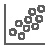

<!-- .slide: class="title" -->

## Charts & Custom Visualizations Beyond the Map

David Martinez & René Rubalcava

@DavidJmart / @odoenet

---

<!-- .slide: class="section" -->

## Visualizations are any medium to present data, visually, to a visual consumer.
- Cartography
- Charts
- Infographics
- Tables

---

<!-- .slide: class="section" -->

## Why Do We Visualize Data?

- Cognitive understanding is faster when visually consumed
- To understand the data
- To frame the data in a different perspective thereby making it easier to reason and consume

---

<!-- .slide: class="section" -->

## Understanding Data

- Compare
- Sort
- Filter
- Highlight
- Aggregate
- Re- express

---

## Examples of Data Visualization

- [3D](https://andygup.github.io/dc-plenary-2019/rotating-globe.html)
- [Python](images/visualization-with-python-ecosystem-matplotlib-seaborn.html)

---

<!-- .slide: class="section" -->

# Cedar

## JavaScript Charts for ArcGIS


<p align="center">

</p>

---

<!-- .slide: class="section" -->

<h3>
Integrated with ArcGIS</h3>

<small class="fragment">Use `url` / `query` or `featureSet`</small>

---

<!-- .slide: class="section" -->

<h3>
 Smart Defaults</h3>

<small class="fragment">(with overrides)</small>

Note:
More and more means aligning w/ Pro's defaults

---

<!-- .slide: class="section" -->

<h3>
Extend, re-use, share</h3>

Note:
find yourself making same overrides again and again, create own chart type

---

<!-- .slide: class="section" -->

## Process

<div class="center-align">
  <div class="stack fragment">
    
    
  </div>
  <div class="stack fragment">
    
    
  </div>
  <div class="stack fragment">
    <code style="font-size: 2em">{}</code>
    <br><code style="font-size: .6em">definition</code>
  </div>
  <div class="fragment">
    
  </div>
  <div class="fragment">
    
  </div>
</div>

---

<!-- .slide: class="section" -->

<h3>
Getting started</h3>

---

<!-- .slide: class="section" -->

<a href="https://codepen.io/davidjmart/pen/WPoQBE"></a>

Let's build [this chart](https://codepen.io/davidjmart/pen/WPoQBE)

---

<!-- .slide: class="section" -->

## Install with package manager
<div><code>npm install --save @esri/cedar</code></div>
<div class="fragment">or <code>yarn add @esri/cedar</code></div>

---

<!-- .slide: class="section" -->

## Or from CDN

```html
<!-- load the amCharts base library -->
<script src="https://www.amcharts.com/lib/3/amcharts.js"></script>
<!-- for bar, line, and area charts -->
<script src="https://www.amcharts.com/lib/3/serial.js"></script>
<!-- optionally load calcite theme -->
<script src="https://unpkg.com/@esri/cedar/dist/umd/themes/amCharts/calcite.js"></script>
<!-- load cedar -->
<script src="https://unpkg.com/@esri/cedar"></script>
```

---

<!-- .slide: class="section" -->

## Build definition

```js
var definition = {};
```
<ul>
  <li class="fragment">Just a POJO</li>
  <li class="fragment">Minimum: `type`, `datasets`, `series`</li>
<ul>

---

<!-- .slide: class="section" -->

## Definition `type`

```js
definition.type = 'bar';
```
<ul>
  <li class="fragment">Predefined: `'bar'`, `'line'`, `'scatter'`, `'pie'`</li>
  <li class="fragment">Or provide your own: `specification: {...}`</li>
<ul>

---

<!-- .slide: class="section" -->

## Definition `datasets`

```js
definition.datatsets = [{
  url: "https://server.arcgisonline.com/arcgis/rest/services/Demographis/USA_Population_Density/MapServer/4",
  query: { orderByFields: "TotPop DESC" }
}]
```

---

<!-- .slide: class="section" -->

## Definition `series`

```js
definition.series = [
  {
    category: {field:"NAME",label:"US State"},
    value: {field:"TOTPOP_CY",label:"Population"}
  }
]
```

---

<!-- .slide: class="section" -->

```js
import { Chart } from '@esri/cedar';

// create a new cedar chart at a specified element
const myChart = new Chart('elementId', definition)
```

---

<!-- .slide: class="section" -->

## Create chart instance (UMD)


```js
// create a new cedar chart at a specified element
var myChart = new cedar.Chart('elementId', definition)
```

&nbsp;

---

<!-- .slide: class="section" -->

## Show the chart

```js
// execute query and render chart
cedarChart.show()
```

---

<!-- .slide: class="section" -->

<h3> Working with maps</h3>

---

<!-- .slide: class="section" -->

## Charting features

<a href="https://codepen.io/davidjmart/pen/daOYgB"></a>

---

<!-- .slide: class="section" -->

## Dataset `data`

```js
definition.datatsets = [{
  data: { features: graphics }
}]
```

Expects a [FeatureSet](https://esri.github.io/arcgis-rest-js/api/common-types/IFeatureSet/)

Note:
- _instead_ of `url` and `query`

---

<!-- .slide: class="section" -->

## Use JavaScript to filter/sort

```js
graphics.sort(function(a, b) {
  return b.attributes.Grand_Tota -a.attributes.Grand_Tota;
});
```

---

<!-- .slide: class="section" -->

## Client-side Queries

<a href="https://jsbin.com/juqafec/edit?html,output"></a>

---

<!-- .slide: class="section" -->

## Dataset `data` with aggregate `query`

```js
definition.datasets: [{
  url: "https://services.arcgis.com/bkrWlSKcjUDFDtgw/arcgis/rest/services/It's_a_Tornado_Map/FeatureServer/0",
  query: {
    groupByFieldsForStatistics: "state",
    outStatistics: [{
      statisticType: "sum",
      onStatisticField: "injuries",
      outStatisticFieldName: "injuries_SUM"
    }]
  }
}]
```

Accepts any [valid query parameters](https://esri.github.io/arcgis-rest-js/api/feature-service/IQueryFeaturesParams/)

---

<!-- .slide: class="section" -->

## Chart [types](http://cedar-v1.surge.sh/)

<a href="http://cedar-v1.surge.sh/?type=bar"></a>
<a href="http://cedar-v1.surge.sh/?type=line"></a>
<a href="http://cedar-v1.surge.sh/?type=area"></a>
<a href="http://cedar-v1.surge.sh/?type=scatter"></a>
<a href="http://cedar-v1.surge.sh/?type=pie"></a>
<a href="http://cedar-v1.surge.sh/?type=bar-grouped"></a>

---

<!-- .slide: class="section" -->

## Overriding chart defaults

```js
definition.overrides = {
  categoryAxis: {
    labelRotation: -45
  },
  legend: {
    enabled: true
  }
}
```

Accepts any [amCharts config parameters](https://docs.amcharts.com/3/javascriptcharts/AmChart)

---

<!-- .slide: class="section" -->

## Better to use cedar API

```js
definition.overrides = {
  categoryAxis: {
    labelRotation: -45
  }
}

definition.legend = {
  visible: true
}
```

Note:
- we're expanding API
- aligning w/ shared chart spec

---

<!-- .slide: class="section" -->

## Create your own chart specification

```js
definition.specification = {
  type: 'serial',
  categoryField: 'category',
  categoryAxis: {
    gridPosition: 'start'
  },
  graphs: [
    {
      title: 'Graph title',
      valueField: 'column-1'
    }
  ],
  valueAxes: [
    {
      title: 'Axis title'
    }
  ],
  legend: {
    useGraphSettings: true
  },
  titles: [
    {
      size: 15,
      text: 'Chart Title'
    }
  ]
}

```

Accepts any [amCharts config parameters](https://docs.amcharts.com/3/javascriptcharts/AmChart) -->

---

<!-- .slide: class="section" -->

# SmartMapping

---

## Exploring Age

- _Age_: Time elapsed between two dates
- Need at least one date field

---

## createAgeRenderer

```js
const ageParams = {
  layer: layer,
  view: view,
  basemap: map.basemap,
  startTime: "INSPECTION_DATE",
  endTime: Date.now(),
  theme: "above-and-below"
};

// smart mapping will determine age units to use
const rendererResponse =
    await colorRendererCreator.createAgeRenderer(ageParams);
layer.renderer = rendererResponse.renderer;
```

---

## createAgeRenderer

- Will generate the age for you using [`DateDiff`](https://developers.arcgis.com/arcade/function-reference/date_functions/#datediff)

```js
DateDiff(endDate, startDate, 'years');
```

---

<iframe height='600' scrolling='no' title='createAgeRenderer' src='https://ekenes.github.io/esri-ts-samples/visualization/smart-mapping/age/' frameborder='no' allowtransparency='true' allowfullscreen='true' style='width: 100%;'>
</iframe>

---

## createContinuousRenderer

- You construct the Arcade expression yourself
- Color or size

```js
const ageParams = {
  layer: layer,
  view: view,
  basemap: map.basemap,
  // subtracts the current year from the construction year
  valueExpression: "Year(Date()) - $feature.CNSTRCT_YR",
  theme: "above-and-below"
};

const rendererResponse =
    await colorRendererCreator.createContinuousRenderer(ageParams);
layer.renderer = rendererResponse.renderer;
```

---

<iframe height='600' scrolling='no' title='createContinuousRenderer' src='https://ekenes.github.io/esri-ts-samples/visualization/smart-mapping/age-buildings/' frameborder='no' allowtransparency='true' allowfullscreen='true' style='width: 100%;'>
</iframe>

---

## Relationship

- Visualize the relationship between values
- A bivariate renderer

---

## Relationship

```js
const params = {
  layer: layer,
  view: view,
  basemap: map.basemap,
  field1: {
    field: "StarScore"
  },
  field2: {
    field: "ElectricUse"
  },
  // HIGH field 1 value & HIGH field 2 value
  // corner of legend is on top
  focus: "HH",
  numClasses: 2
};

const response = await relationshipRendererCreator.createRenderer(params);
layer.renderer = response.renderer;
```

---

<iframe height='600' scrolling='no' title='Relationship' src='https://developers.arcgis.com/javascript/latest/sample-code/visualization-sm-relationship/live/index.html' frameborder='no' allowtransparency='true' allowfullscreen='true' style='width: 100%;'>
</iframe>

---

## Predominance

- Visualize data based on attributes based on which one wins
- Election results, survey results, demographic majorities

---

## Predominance

```js
// Gets all the predominance schemes available in the JS API
const schemes = predominanceSchemes.getSchemes({
  basemap: map.basemap,
  geometryType: "polygon",
  numColors: 10
});
const params = {
  view,
  layer,
  fields,
  predominanceScheme: schemes.secondarySchemes[6],
  sortBy: "value",
  basemap: view.map.basemap,
  includeSizeVariable: includeSizeCheckbox.checked,
  includeOpacityVariable: includeOpacityCheckbox.checked,
  legendOptions: {
    title: "Most common decade in which homes were built"
  }
};

const predominanceResponse = predominanceRendererCreator.createRenderer(params);
layer.renderer = predominanceResponse.renderer;
```

---


---

## Predominance

<iframe height='600' scrolling='no' title='Relationship' src='https://ekenes.github.io/esri-ts-samples/visualization/smart-mapping/predominance/boise-housing/' frameborder='no' allowtransparency='true' allowfullscreen='true' style='width: 100%;'>
</iframe>

---

<!-- .slide: class="section" -->

# 3D Visualizations

---

## FeatureLayers in 3D - Polygon 3D Renderer

```js
var contourLayer = new FeatureLayer({
  url: "...",
  elevationInfo: {
    mode: "relative-to-ground",
    featureExpressionInfo: {
      expression: "$feature.elevation * 3"
    }
  },
  renderer: {
    type: "simple",
    symbol: {
      type: "polygon-3d",
      symbolLayers: [{
        type: "extrude",
        material: {
          color: "#DCD2B0"
        },
        size: 50
      }]
    },
    visualVariables: [{...}]
  }
});
```

---

## FeatureLayers in 3D - Visual Variables

```js
var contourLayer = new FeatureLayer({
  ...
  renderer: {
    type: "simple",
    symbol: {...},
    visualVariables: [{
      type: 'color',
      field: 'elevation',
      stops: [{
        value: 25,
        color: '#F2E6C9',
      }, {
        value: 100,
        color: '#d3a561'
      }, {
        value: 200,
        color: [186, 121, 68]
      }]
    }]
  }
});
```

---

## FeatureLayers in 3D

<iframe height='600' scrolling='no' title='Relationship' src='https://ralucanicola.github.io/JSAPI_demos/malta-contour-lines/' frameborder='no' allowtransparency='true' allowfullscreen='true' style='width: 100%;'>
</iframe>

---

## SceneLayers

---

## SceneLayers - Edges

```js
// Existing Buildings
const buildingsLayer = new SceneLayer({
  portalItem: {...},
  renderer: {
    type: "simple",
    symbol: {
      type: "mesh-3d",
      symbolLayers: [{
        type: "fill",
        material: {
          color: "#ffffff"
        },
        edges: {
          type: "solid",
          color: [0, 0, 0, 0.65],
          size: 0.3
        }
      }]
    }
  }
});
```

---

## SceneLayers - Edges

```js
// New Projects
const projectLayer = new SceneLayer({
  portalItem: {...},
  renderer: {
    type: "simple",
    symbol: {
      type: "mesh-3d",
      symbolLayers: [{
        type: "fill",
        material: {
          color: "#ffd375"
        },
        edges: {
          type: "sketch", // sketch edges
          size: 2,
          color: [50, 50, 50, 0.9],
          extensionLength: 10
        }
      }]
    }
  }
});
```

---

## SceneLayers - Edges

<iframe height='600' scrolling='no' title='Relationship' src='https://ralucanicola.github.io/JSAPI_demos/urban-development/' frameborder='no' allowtransparency='true' allowfullscreen='true' style='width: 100%;'>
</iframe>

---

## Arcade in 3D

---

## Arcade in 3D

```js
const earthquakesLayer = new FeatureLayer({
  url: "...",
  renderer: renderer,
  outfields: ["dateTime", "mag", "depthSigM", "latitude", "longitude"],
  // Use Arcade in Elevation Info
  elevationInfo: {
    mode: "absolute-height",
    featureExpressionInfo: {
      expression: "-Geometry($feature).z * 7"
    }
  },
  popupTemplate: template
});
```

---

## Arcade in 3D

<iframe height='600' scrolling='no' title='Relationship' src='https://ralucanicola.github.io/JSAPI_demos/earthquakes/' frameborder='no' allowtransparency='true' allowfullscreen='true' style='width: 100%;'>
</iframe>

---

## 3D Art

---

## 3D Art - Edge Renderer

```js
// this renderers all the layers with semi-transparent white faces
// and displays the geometry with sketch edges
const renderer = {
  type: "simple",
  symbol: {
    type: "mesh-3d",
    symbolLayers: [{
      type: "fill",
      material: {
        color: [255, 255, 255, 0.1],
        colorMixMode: "replace"
      },
      edges: {
        type: "sketch",
        color: [0, 0, 0, 0.8],
        size: 2,
        extensionLength: 10
      }
    }]
  }
};
```

---

## 3D Art - Transparent Background

```js
const view = new SceneView({
  container: "viewDiv",
  map: webscene,
  // this property should be set to true
  // so that we can set a transparent background
  alphaCompositingEnabled: true,
  ui: {
    components: []
  }
});
```

---

## 3D Art

<iframe height='600' scrolling='no' title='Relationship' src='https://ralucanicola.github.io/JSAPI_demos/sanfranart/' frameborder='no' allowtransparency='true' allowfullscreen='true' style='width: 100%;'>
</iframe>

---

- 3D Demos courtesy of [Raluca Nicola](https://github.com/RalucaNicola/JSAPI_demos)

---

<!-- .slide: class="questions" -->

## Questions?

**Help us to improve** filling out the survey

David Martinez ([@DavidJmart](https://twitter.com/DavidJmart))

Rene Rubalcava ([@odoenet](https://twitter.com/odoenet))

---


<!-- .slide: class="end" -->
