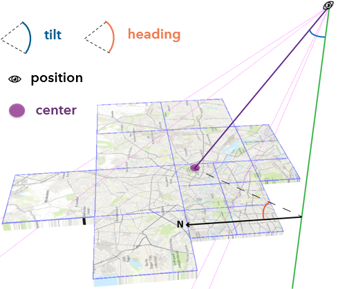
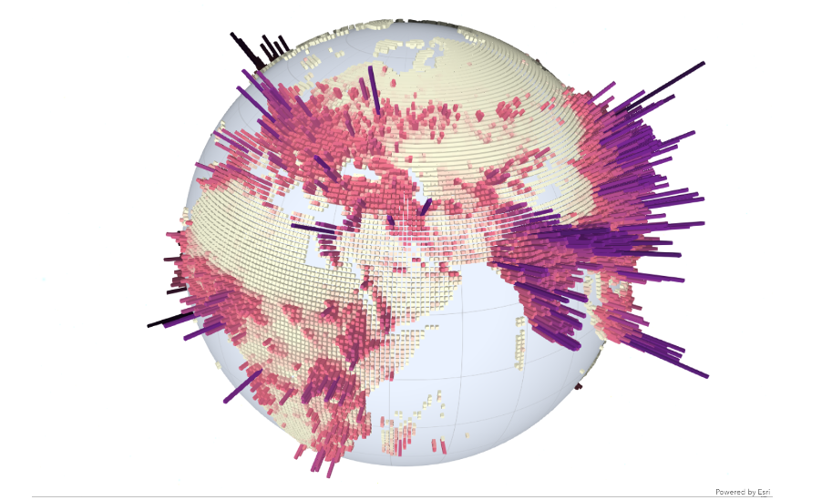
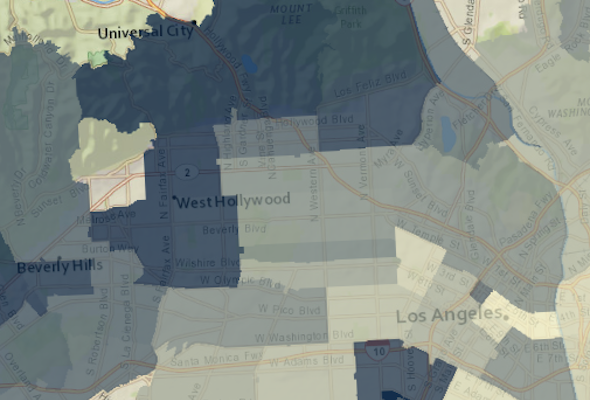
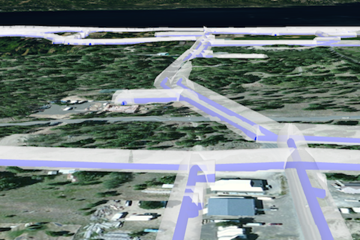
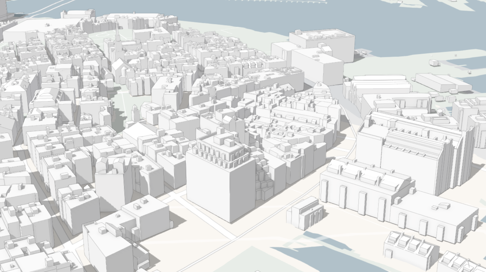
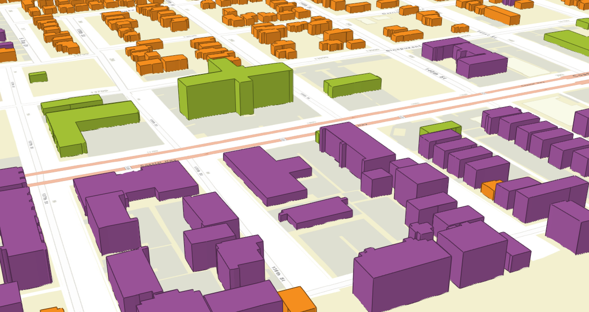
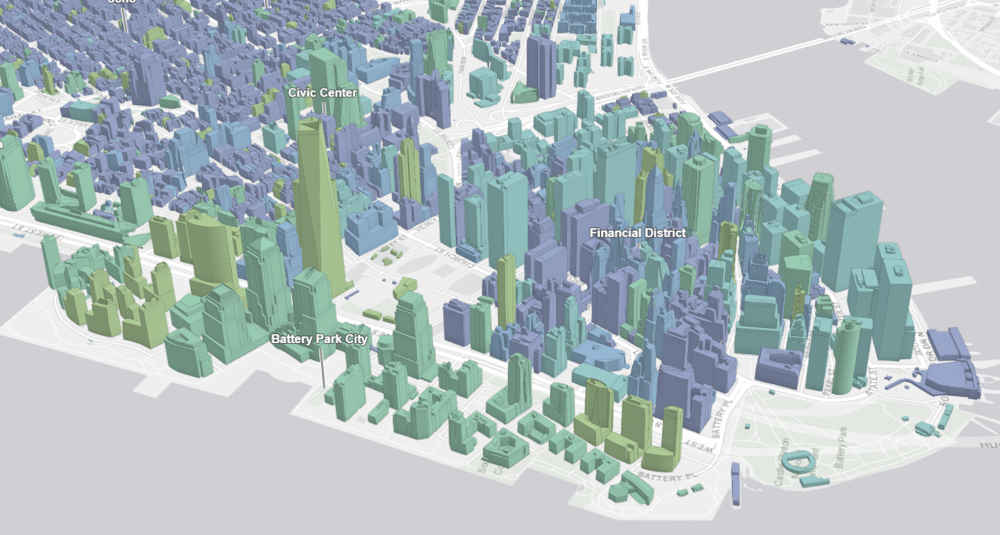
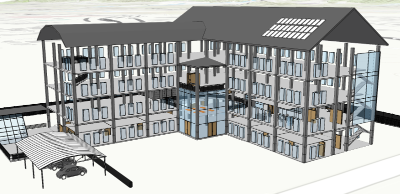
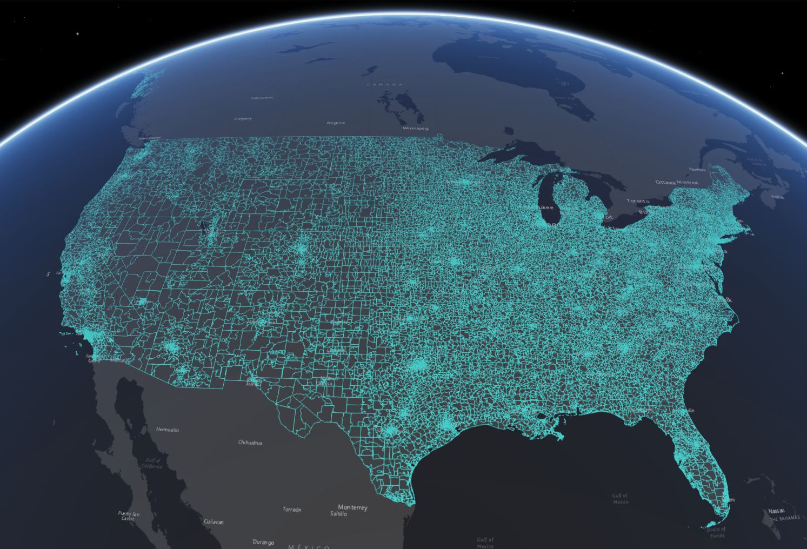

<!-- .slide: data-background="images/bg-1.png" -->

## Getting Started with 3D

### in the ArcGIS API for JavaScript

<br/>

<p>René Rubalcava</p>

---

<!-- .slide: data-background="images/bg-5.png" -->

# API concepts

---

### From 2D to 3D in one step

Start with a 2D map/view, replace [`MapView`](https://developers.arcgis.com/javascript/beta/api-reference/esri-views-MapView.html) with [`SceneView`](https://developers.arcgis.com/javascript/beta/api-reference/esri-views-SceneView.html)

<div class="two-columns">
  <div class="left-column">

<div class="code-snippet">
<pre><code class="lang-js">view = new MapView({
  container: "viewDiv",

  map: new Map({
    layers: [new TileLayer(
      "...Earth_at_Night_2016/MapServer"
    )]
  })
});
</code></pre>
</div>

<div class="code-snippet">
<button class="play" id="scene-view-map-view-button01"></button>
<pre><code class="lang-js">view = new SceneView({
  container: "viewDiv",

  map: new Map({
    layers: [new TileLayer(
      "...Earth_at_Night_2016/MapServer"
    )]
  })
});
</code></pre>
</div>


  </div>
  <div class="right-column">
    <iframe id="scene-view-map-view" data-src="./examples/scene-view-map-view.html" ></iframe>
  </div>
</div>

---

### The Camera

The point of observation in a [`SceneView`](https://developers.arcgis.com/javascript/latest/api-reference/esri-views-SceneView.html) is called a [`Camera`](https://developers.arcgis.com/javascript/latest/api-reference/esri-Camera.html)

<div class="two-columns">
  <div class="left-column">
    <div class="code-snippet">
    <pre><code class="lang-ts">
    class Camera {
      // The position of the camera eye in 3D space (x, y + z elevation)
      position: Point;
      // The heading angle (towards north in degrees, [0, 360]°)
      heading: number;
      // The tilt angle ([0, 180]°, with 0° straight down, 90° horizontal)
      tilt: number;
    }
    </code></pre>
    </div>
</div>
  <div class="right-column">
    
  </div>
</div>

---

### [`Camera`](https://developers.arcgis.com/javascript/latest/api-reference/esri-Camera.html)

<div class="two-columns">
  <div class="left-column">

<div class="code-snippet">
<button class="play" id="scene-view-camera-button01"></button>
<pre><code class="lang-ts">const camera = view.camera.clone();

// Increment the heading of the camera by 5 degrees
camera.heading += 5;

// Set the modified camera on the view
view.camera = camera;</code></pre>
</div>

  </div>
  <div class="right-column">
    <iframe id="camera-demo" data-src="./examples/camera-demo.html" ></iframe>
  </div>
</div>

---

### Camera animations with [`goTo()`](https://developers.arcgis.com/javascript/latest/api-reference/esri-views-SceneView.html#goTo)

<div class="two-columns">
  <div class="left-column">

<div class="code-snippet">
<button class="play" id="scene-view-go-to-button01"></button>
<pre><code class="lang-ts">const h = view.camera.heading;

// Increase the heading by 30 degrees
const heading = h + 30;

// go to heading preserves view.center
view.goTo({
  heading: heading
});</code></pre>
</div>

<div class="code-snippet">
<button class="play" id="scene-view-go-to-button02"></button>
<pre><code class="lang-ts">const h = view.camera.heading;

// Increase the heading by 120 degrees
const heading = h + 120;

const target = {
  heading: heading
};

const options = {
  easing: "out-cubic",
  speedFactor: 0.2
};

view.goTo(target, options);</code></pre>
</div>

  </div>
  <div class="right-column">
    <iframe id="go-to-demo" data-src="./examples/go-to-demo.html" ></iframe>
  </div>
</div>

---

### Viewing mode

|Global|Local|
|-|-|
| geographic, spherical| projected, planar, clipping|
| |  |
|`view.viewingMode = "global"` | `view.viewingMode = "local"`|

---

## The Ground

- A Map contains [`Ground`](https://developers.arcgis.com/javascript/latest/api-reference/esri-Ground.html), a [`Basemap`](https://developers.arcgis.com/javascript/latest/api-reference/esri-Basemap.html) and [`Layers`](https://developers.arcgis.com/javascript/latest/api-reference/esri-layers-Layer.html).
- `Ground`:
  - Defines the ground surface of the scene
  - Contains [`ElevationLayers`](https://developers.arcgis.com/javascript/latest/api-reference/esri-layers-ElevationLayer.html)
  - Underground navigation in both global and local scenes

---

## The Ground &mdash; example

<div class="two-columns">
  <div class="left-column">

<div class="code-snippet">
<pre><code class="lang-js">

map.ground = new Ground({
  // set elevation layers
  layers: [
    new ElevationLayer({
      url: ".../WorldElevation3D/Terrain3D/ImageServer"
    })
  ],

  // allow navigation above and below the ground
  navigationConstraint: {
    type: "none"
  },

  // set a color instead of basemap
  surfaceColor: "#ffffff",

  // fully opaque ground
  opacity: 1
});
</code></pre>
</div>

  </div>
  <div class="right-column">
    <iframe id="underground" data-src="./examples/underground.html" ></iframe>
  </div>
</div>

---

## `ElevationLayer`

- Elevation services
  - Tiled image service
  - LERC format (Limited Error Raster Compression)
- Added to `map.ground.layers`
 - Multiple elevation layers overlay just as map layers do
  - Provided by Esri: `"world-elevation"`, `"world-topobathymetry"`
  - Custom elevation layers
- `async queryElevation(geometry)`

---

## `ElevationLayer`

<div class="two-columns">
  <div class="left-column">

<div class="code-snippet small">
<pre><code class="lang-js">var map = new Map({
  basemap: "satellite",
  ground: "world-elevation" // use default world elevation layer
});

// load an additional elevation layer depicting the
// elevation difference after the 2014 Oso landslide
var elevationLayer = new ElevationLayer({
  url: ".../OsoLandslide_After_3DTerrain/ImageServer",
  visible: false
});

map.ground.layers.add(elevationLayer);

var view = new SceneView(...);
</code></pre>
</div>

<div class="code-snippet small">
<button class="play" id="elevation-layers-button01"></button>
<pre><code class="lang-js">// toggle the elevation layer visiblity
elevationLayer.visible = !elevationLayer.visible
</code></pre>
</div>

<div class="code-snippet small">
<pre><code class="lang-js">// query elevation at the clicked map point
view.on("click", function(event) {
  var position = event.mapPoint;
  var query = elevationLayer.queryElevation(position);
  query.then((result) => {
    console.log(result.geometry.z)
  });
});
</code></pre>
</div>
<div class="code-output">
  <pre id="elevation-layer-output01"></pre>
</div>

  </div>
  <div class="right-column">
    <iframe id="elevation-layers" data-src="./examples/elevation-layers.html" ></iframe>
  </div>
</div>

---

# Layers

---

## Layers

| Layer type   | Characteristics |
|--------------|-----------------|
| `FeatureLayer` | vector |
| `CSVLayer` | vector |
| `StreamLayer` | vector |
| `MapImageLayer` | raster, dynamic |
| `ImageryLayer` | raster, dynamic |
| `WMSLayer` | raster, dynamic |
| `OpenStreetMapLayer` | raster, cached |
| `TileLayer` | raster, cached |
| `WebTileLayer` | raster, cached |
| `WMTSLayer` | raster, cached |
| `VectorTileLayer` | vector, cached |

---

## Layers &mdash; `elevationInfo`

- `relative-to-ground`, `absolute-height`, `on-the-ground`
- `relative-to-scene`

<div class="two-columns">
  <div class="left-column">

  <div class="code-snippet small">
<pre><code class="lang-js">
greenLayer.elevationInfo = {
  mode: "relative-to-ground",
  offset: 3000
};

blueLayer.elevationInfo = {
  mode: "absolute-height",
  offset: 3000
};

redLayer.elevationInfo = {
  mode: "on-the-ground"
};
</code></pre>
</div>

  </div>
  <div class="right-column">
    <iframe id="feature-layers-elevation-mode" data-src="./examples/feature-layers-elevation-mode.html" ></iframe>
  </div>
</div>

---

## Specific 3D Layers

| Layer type   | Characteristics |
|--------------|-----------------|
| `ElevationLayer` | raster, cached |
| `SceneLayer` (point) | vector |
| `SceneLayer` (3d object) | vector |
| `IntegratedMeshLayer` | vector |
| `PointCloudLayer` | vector |

---

## 3D Layers &mdash; `SceneLayer` (points)

<div class="two-columns">
  <div class="left-column">

<div class="code-snippet">
<pre><code class="lang-js">// all the typical initialization
var map = new Map(...);
var view = new SceneView(...);

// Create SceneLayer and add to the map
var sceneLayer = new SceneLayer({
   url: ".../Airports_PointSceneLayer/SceneServer"
});

map.add(sceneLayer);
</code></pre>
</div>

  </div>
  <div class="right-column">
    <iframe id="scene-layer-points" data-src="./examples/scene-layer-points.html" ></iframe>
  </div>
</div>

---

## 3D Layers &mdash; `SceneLayer` (3d object)

<div class="two-columns">
  <div class="left-column">

<div class="code-snippet">
<pre><code class="lang-js">// all the typical initialization
var map = new Map(...);
var view = new SceneView(...);

// Create SceneLayer and add to the map
var sceneLayer = new SceneLayer({
  url: ".../NYCatt/SceneServer",
});

map.add(sceneLayer);
</code></pre>
</div>

<div class="code-snippet">
<button class="play" id="mesh-filtering-button01"></button>
<pre><code class="lang-js">// only show buildings constructed before 1900
sceneLayer.definitionExpression =
  "CNSTRCT_YR < 1900";
</code></pre>
</div>

  </div>
  <div class="right-column">
    <iframe id="scene-layer-mesh2" data-src="./examples/scene-layer-mesh.html" ></iframe>
  </div>
</div>

---

## 3D Layers &mdash; `IntegratedMeshLayer`

<div class="two-columns">
  <div class="left-column">

<div class="code-snippet">
<pre><code class="lang-js">// create the integrated mesh layer
var layer = new IntegratedMeshLayer({
  url: ".../Girona_Spain/SceneServer"
});

// create a map with the layer added
var map = new Map({
  basemap: "streets",
  layers: [layer],
  ground: "world-elevation"
});

// finally, create a view with a good
// perspective on the integrated mesh
var view = new SceneView({
  container: "viewDiv",
  map: map,
  camera:  {
    position: [2.82434683, 41.98238212, 167.97381],
    heading: 341.69,
    tilt: 66.56
  }
});
</code></pre>
</div>

  </div>
  <div class="right-column">
    <iframe id="integrated-mesh" data-src="./examples/integrated-mesh.html" ></iframe>
  </div>
</div>

---

## 3D Layers &mdash; `PointCloudLayer`

<div class="two-columns">
  <div class="left-column">

<div class="code-snippet">
<pre><code class="lang-js">// all the typical initialization
var map = new Map(...);
var view = new SceneView(...);

// create Point Cloud Layer
var pcLayer = new PointCloudLayer({
  url: ".../BARNEGAT_BAY_LiDAR_UTM/SceneServer"
});

map.add(pcLayer);
</code></pre>
</div>

<div class="code-snippet">
<pre><code class="lang-js">// update the render settings
function updateRenderer(pointSize, density) {
  pcLayer.renderer = new PointCloudRGBRenderer({
    field: "RGB",
    pointSizeAlgorithm: {
      type: "fixed-size",
      useRealWorldSymbolSizes: false,
      size: pSize
    },
    pointsPerInch: density
  })
}
</code></pre>
</div>

  </div>
  <div class="right-column">
    <iframe id="pointcloud-size-and-density" data-src="./examples/pointcloud-size-and-density.html" ></iframe>
  </div>
</div>

---

# 3D Visualization

---

## Symbols


<table class="symbology">
  <tr>
    <th>PointSymbol3D</th>
    <th>LineSymbol3D</th>
    <th>PolygonSymbol3D</th>
    <th>MeshSymbol3D</th>
  </tr>
  <tr>
    <!-- (flat) IconSymbol3DLayer - LineSymbol3DLayer - FillSymbol3DLayer -->
    <td>
      <span class="image-title">IconSymbol3DLayer</span>
      
    </td>
    <td>
      <span class="image-title">LineSymbol3DLayer</span>
      
    </td>
    <td>
      <span class="image-title dark">FillSymbol3DLayer</span>
      
    </td>
    <td>
      <span class="image-title dark">FillSymbol3DLayer</span>
      
    </td>
  </tr>
  <tr>
    <!-- (volumetric) ObjectSymbol3DLayer - PathSymbol3DLayer - ExtrudeSymbol3DLayer -->
    <td>
      <span class="image-title">ObjectSymbol3DLayer</span>
      
    </td>
    <td>
      <span class="image-title">PathSymbol3DLayer</span>
      
    </td>
    <td>
      <span class="image-title">ExtrudeSymbol3DLayer</span>
      
    </td>
  </tr>
</table>

---

## Symbology &mdash; `WebStyleSymbol`


```ts
const webStyleSymbol = new WebStyleSymbol({
  name: "Traffic_Barrier_1",
  styleName: "EsriRealisticStreetSceneStyle"
});
```

<a href="https://developers.arcgis.com/javascript/latest/sample-code/playground/live/index.html#/config=symbols/3d/WebStyleSymbol.json" target="_blank">Try it in symbol playground</a>

---

## Renderers

<table class="symbology">
  <tr>
    <th>SimpleRenderer</th>
    <th>UniqueValueRenderer</th>
    <th>ClassBreaksRenderer</th>
  </tr>
  <tr>
    <td>
      
    </td>
    <td>
      
    </td>
    <td>
      
    </td>
  </tr>
</table>

---

## 3D buildings visualization

<div class="two-columns">
  <div class="left-column">

<div class="code-snippet">
<pre><code class="lang-js">
const buildingsLayer = new SceneLayer({
  url: "...Buildings_walk_time_attributes/SceneServer/",
  renderer: new SimpleRenderer({
    symbol: new MeshSymbol3D({
      symbolLayers: [new FillSymbol3DLayer({
        material: {
          color: [239, 224, 184]
        }
      })]
    })
  })
});

map.add(buildingsLayer);
</code></pre>
</div>

  </div>
  <div class="right-column">
    <iframe id="integrated-mesh" data-src="./examples/scene-layer-renderer.html" ></iframe>
  </div>
</div>

---

## Visual variables

<div class="two-columns">
  <div class="left-column">

<div class="code-snippet">
<button class="play" id="visual-variables-button"></button>
<pre><code class="lang-js">
const renderer = buildingsLayer.renderer.clone();
renderer.visualVariables = [{
  type: "color",
  field: "walkTimeToStopsInService",
  legendOptions: {
    title: "Walking time to public transport"
  },
  stops: [
    {
      value: 1,
      label: "less than 1 minute",
      color: [96, 109, 148, 1]
    },
    {
      value: 15,
      label: "more than 15 minutes",
      color: [197, 156, 164, 1]
    }
  ]
}];
buildingsLayer.renderer = renderer;
</code></pre>
</div>

  </div>
  <div class="right-column">
    <iframe id="integrated-mesh" data-src="./examples/scene-layer-renderer.html" ></iframe>
  </div>
</div>

---

## Edge rendering

<div class="two-columns">
  <div class="left-column">

<div class="code-snippet">
<button class="play" id="edge-rendering-button"></button>
<pre><code class="lang-js">
const renderer = buildingsLayer.renderer.clone();
const symbol = renderer.symbol;
const symbolLayer = symbol.symbolLayers.getItemAt(0);
symbolLayer.edges = {
  type: "solid",
  color: [255, 255, 255, 0.4],
  size: 1
}
buildingsLayer.renderer = renderer;
</code></pre>
</div>

  </div>
  <div class="right-column">
    <iframe id="integrated-mesh" data-src="./examples/scene-layer-edges.html" ></iframe>
  </div>
</div>

---

<!-- .slide: data-background="./images/bg-5 .png" -->

# WebScene

---

## WebScene

- Defines the content and style of a 3D Scene
- Supported by [`SceneView`](https://developers.arcgis.com/javascript/latest/api-reference/esri-views-SceneView.html)
- Loadable from [`Portal`](https://developers.arcgis.com/javascript/latest/api-reference/esri-portal-Portal.html)

```ts
class WebScene extends Map {
  presentation: {
    slides: Collection<Slide>;
  };

  initialViewProperties: {
    viewpoint: Viewpoint;
    environment: Environment;
    spatialReference: SpatialReference;
    viewingMode: "global" | "local";
  };

  portalItem: PortalItem;

  clippingArea: Extent;
  clippingEnabled: boolean;
}
```

---

## WebScene &mdash; API

- Serialized as JSON and stored in ArcGIS Enterprise/Online
- Specification (layers, basemap, initial state, metadata...)
https://developers.arcgis.com/web-scene-specification/

---

# Widgets

---

## 3D widgets

- Direct line measurement
- [`esri/widgets/DirectLineMeasurement3D`](https://developers.arcgis.com/javascript/latest/sample-code/widgets-directlinemeasurement-3d/live/index.html)


---

## 3D widgets

- Area measurement
- [`esri/widgets/AreaMeasurement3D`](https://developers.arcgis.com/javascript/latest/sample-code/widgets-areameasurement-3d/live/index.html)


---

<!-- .slide: data-background="./images/bg-5 .png" -->

# Building an App


---

## Building an App: Lyon

<div class="twos">
  <div class="snippet">
  <pre><code class="lang-js hljs javascript">var renderer = new UniqueValueRenderer({
  field: "Type",
  uniqueValueInfos: [{
    value: "Museum",
    symbol: createSymbol("Museum.png", "#D13470")
  }, {
    value: "Restaurant",
    symbol: createSymbol("Restaurant.png", "#F97C5A")
  }, {
    value: "Church",
    symbol: createSymbol("Church.png", "#884614")
  }, {
    value: "Hotel",
    symbol: createSymbol("Hotel.png", "#56B2D6")
  }, {
    value: "Park",
    symbol: createSymbol("Park.png", "#40C2B4")
  }]
});

var featLayer = new FeatureLayer({
  portalItem: {
    id: "5acdabddfb1f4852932d43f51fca57eb"
  },
  renderer: renderer
});</code>
   </pre>
  <!--<svg data-play-frame="frame-auto-cast" class="play-code" viewBox="0 0 24 24"><path fill="#999" d="M12,20.14C7.59,20.14 4,16.55 4,12.14C4,7.73 7.59,4.14 12,4.14C16.41,4.14 20,7.73 20,12.14C20,16.55 16.41,20.14 12,20.14M12,2.14A10,10 0 0,0 2,12.14A10,10 0 0,0 12,22.14A10,10 0 0,0 22,12.14C22,6.61 17.5,2.14 12,2.14M10,16.64L16,12.14L10,7.64V16.64Z" /></svg>-->
  </div>
  <div class="snippet-preview">
    <iframe id="frame-auto-cast" data-src="./snippets/lyon/01-basics.html"></iframe>
  </div>
</div>

---

## Elevation mode: `relative-to-scene`

<div class="twos">
  <div class="snippet">
  <pre><code class="lang-js hljs javascript">var featLayer = new FeatureLayer({
  portalItem: {
    id: "5acdabddfb1f4852932d43f51fca57eb"
  },
  renderer: renderer,
  elevationInfo: {
    mode: "relative-to-scene"
  }
});</code>
   </pre>
  <!--<svg data-play-frame="frame-auto-cast" class="play-code" viewBox="0 0 24 24"><path fill="#999" d="M12,20.14C7.59,20.14 4,16.55 4,12.14C4,7.73 7.59,4.14 12,4.14C16.41,4.14 20,7.73 20,12.14C20,16.55 16.41,20.14 12,20.14M12,2.14A10,10 0 0,0 2,12.14A10,10 0 0,0 12,22.14A10,10 0 0,0 22,12.14C22,6.61 17.5,2.14 12,2.14M10,16.64L16,12.14L10,7.64V16.64Z" /></svg>-->
  </div>
  <div class="snippet-preview">
    <iframe id="frame-auto-cast" data-src="./snippets/lyon/02-relative.html"></iframe>
  </div>
</div>

---

## Callout Lines

Lift symbols above the ground for better visibility.

<div class="twos">
  <div class="snippet">
  <pre><code class="lang-js hljs javascript">new PointSymbol3D({
  symbolLayers: ...,

  verticalOffset: {
    screenLength: 30,
    maxWorldLength: 200
  },

  callout: new LineCallout3D({
    color: "white",
    size: 2,

    border: {
      color: color
    }
  })
});</code>
   </pre>
  <!--<svg data-play-frame="frame-auto-cast" class="play-code" viewBox="0 0 24 24"><path fill="#999" d="M12,20.14C7.59,20.14 4,16.55 4,12.14C4,7.73 7.59,4.14 12,4.14C16.41,4.14 20,7.73 20,12.14C20,16.55 16.41,20.14 12,20.14M12,2.14A10,10 0 0,0 2,12.14A10,10 0 0,0 12,22.14A10,10 0 0,0 22,12.14C22,6.61 17.5,2.14 12,2.14M10,16.64L16,12.14L10,7.64V16.64Z" /></svg>-->
  </div>
  <div class="snippet-preview">
    <iframe id="frame-auto-cast" data-src="./snippets/lyon/03-callout.html"></iframe>
  </div>
</div>

---

## Declutter

Number of overlapping points is reduced

<div class="twos">
  <div class="snippet">
  <pre><code class="lang-js hljs javascript">var featLayer = new FeatureLayer({
  portalItem: {
    id: "5acdabddfb1f4852932d43f51fca57eb"
  },

  renderer: renderer,

  elevationInfo: {
    mode: "relative-to-scene"
  },

  featureReduction: {
    type: "selection"
  }
});</code>
   </pre>
  <!--<svg data-play-frame="frame-auto-cast" class="play-code" viewBox="0 0 24 24"><path fill="#999" d="M12,20.14C7.59,20.14 4,16.55 4,12.14C4,7.73 7.59,4.14 12,4.14C16.41,4.14 20,7.73 20,12.14C20,16.55 16.41,20.14 12,20.14M12,2.14A10,10 0 0,0 2,12.14A10,10 0 0,0 12,22.14A10,10 0 0,0 22,12.14C22,6.61 17.5,2.14 12,2.14M10,16.64L16,12.14L10,7.64V16.64Z" /></svg>-->
  </div>
  <div class="snippet-preview">
    <iframe id="frame-auto-cast" data-src="./snippets/lyon/04-declutter.html"></iframe>
  </div>
</div>

---

## Improve Perspective

Improve the sense of depth for 2D icons

<div class="twos">
  <div class="snippet">
  <pre><code class="lang-js hljs javascript">var featLayer = new FeatureLayer({
  portalItem: {
    id: "5acdabddfb1f4852932d43f51fca57eb"
  },

  renderer: renderer,

  elevationInfo: {
    mode: "relative-to-scene"
  },

  featureReduction: {
    type: "selection"
  },

  screenSizePerspectiveEnabled: true
});</code>
   </pre>
  <!--<svg data-play-frame="frame-auto-cast" class="play-code" viewBox="0 0 24 24"><path fill="#999" d="M12,20.14C7.59,20.14 4,16.55 4,12.14C4,7.73 7.59,4.14 12,4.14C16.41,4.14 20,7.73 20,12.14C20,16.55 16.41,20.14 12,20.14M12,2.14A10,10 0 0,0 2,12.14A10,10 0 0,0 12,22.14A10,10 0 0,0 22,12.14C22,6.61 17.5,2.14 12,2.14M10,16.64L16,12.14L10,7.64V16.64Z" /></svg>-->
  </div>
  <div class="snippet-preview">
    <iframe id="frame-auto-cast" data-src="./snippets/lyon/05-perspective.html"></iframe>
  </div>
</div>

---

## 3D Models

Use WebStyleSymbols to include 3d models in your scene

<div class="twos">
  <div class="snippet">
  <pre><code class="lang-js hljs javascript">new UniqueValueRenderer({
  field: "TYPE",
  uniqueValueInfos: [
    {
      value: "taxi",

      symbol: new WebStyleSymbol({
        name: "Taxi",
        styleName: "EsriRealisticTransportationStyle"
      })
    }
  // ...
  ]
});</code>
   </pre>
  <!--<svg data-play-frame="frame-auto-cast" class="play-code" viewBox="0 0 24 24"><path fill="#999" d="M12,20.14C7.59,20.14 4,16.55 4,12.14C4,7.73 7.59,4.14 12,4.14C16.41,4.14 20,7.73 20,12.14C20,16.55 16.41,20.14 12,20.14M12,2.14A10,10 0 0,0 2,12.14A10,10 0 0,0 12,22.14A10,10 0 0,0 22,12.14C22,6.61 17.5,2.14 12,2.14M10,16.64L16,12.14L10,7.64V16.64Z" /></svg>-->
  </div>
  <div class="snippet-preview">
    <iframe id="frame-auto-cast" data-src="./snippets/lyon/06-models.html"></iframe>
  </div>
</div>

---

## Webscene loading

Loading a webscene by id

<div class="twos">
  <div class="snippet">
  <pre><code class="lang-js hljs javascript">var map = new WebScene({
  portalItem: {
    id: "8b464fd68d87480486d36e8cbbc52ab9"
  }
});

var view = new SceneView({
  container: "viewDiv",
  map: map
});</code>
   </pre>
  <!--<svg data-play-frame="frame-auto-cast" class="play-code" viewBox="0 0 24 24"><path fill="#999" d="M12,20.14C7.59,20.14 4,16.55 4,12.14C4,7.73 7.59,4.14 12,4.14C16.41,4.14 20,7.73 20,12.14C20,16.55 16.41,20.14 12,20.14M12,2.14A10,10 0 0,0 2,12.14A10,10 0 0,0 12,22.14A10,10 0 0,0 22,12.14C22,6.61 17.5,2.14 12,2.14M10,16.64L16,12.14L10,7.64V16.64Z" /></svg>-->
  </div>
  <div class="snippet-preview">
    <iframe id="frame-auto-cast" data-src="./snippets/lyon/07-webscene-load.html"></iframe>
  </div>
</div>

---

## Popups and webscene saving

Adding a custom popup template and saving the webscene

<div class="twos">
  <div class="snippet">
  <pre><code class="lang-js hljs javascript">featLayer.popupTemplate = new PopupTemplate({
    title: "{NAME}",
    content: "{ADDRESS}<br/>" +
    "Telephone: {TELEPHONE}<br/>" +
    "Website: {WEBSITE}<br/>"
  });
});

// ...

var portal = new Portal({
  url: myPortalUrl,
  authMode: "immediate"
});

portal.load().then(function() {
  webscene.saveAs({
    title: "My Scene",
    portal: portal
  });
});</code>
   </pre>
  <!--<svg data-play-frame="frame-auto-cast" class="play-code" viewBox="0 0 24 24"><path fill="#999" d="M12,20.14C7.59,20.14 4,16.55 4,12.14C4,7.73 7.59,4.14 12,4.14C16.41,4.14 20,7.73 20,12.14C20,16.55 16.41,20.14 12,20.14M12,2.14A10,10 0 0,0 2,12.14A10,10 0 0,0 12,22.14A10,10 0 0,0 22,12.14C22,6.61 17.5,2.14 12,2.14M10,16.64L16,12.14L10,7.64V16.64Z" /></svg>-->
  </div>
  <div class="snippet-preview">
    <iframe id="frame-auto-cast" data-src="./snippets/lyon/08-popup.html"></iframe>
  </div>
</div>

---

<!-- .slide: data-background="images/bg-5.png" -->

# New features in 4.10

---

## BuildingSceneLayer

- A new SceneLayer type specific for building interiors



---

## Slice widget

- 3D analysis tool used to reveal occluded content in a SceneView


---

## Loading large datasets

- Support for large feature layers with line and polygon geometry



---

## Filter point clouds

- Points can now be filtered based on point classes


---

<!-- .slide: data-background="./images/bg-final.png" -->

